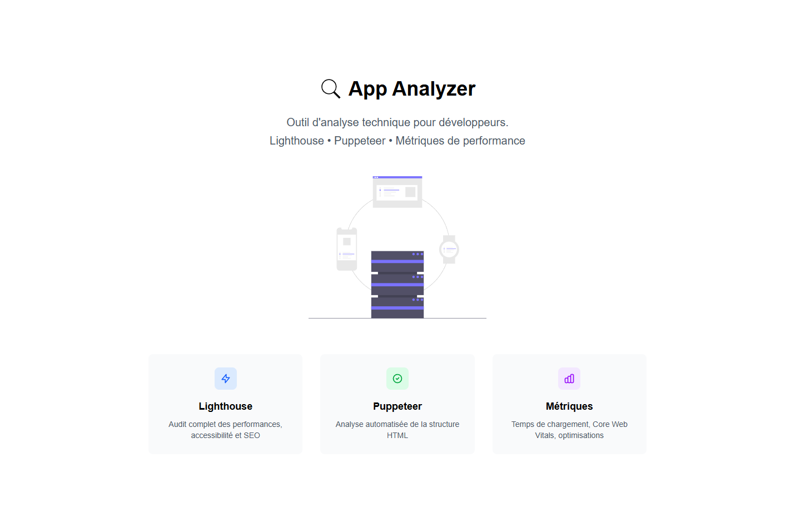

# App Analyzer - API d'Audit Web Automatique

Une API Next.js complète pour l'audit automatique de sites web utilisant Puppeteer et Lighthouse.



## Fonctionnalités

- Analyse HTML complète : balises meta, structure des titres, attributs alt
- Métriques de performance : temps de chargement, FCP, LCP, responsive design
- Intégration Lighthouse : scores SEO, performance, accessibilité, bonnes pratiques
- Extraction d'informations : titre de page et premier H1 automatiquement extraits
- Rapport JSON normalisé : issues, recommandations, score global, informations de page
- Gestion d'erreurs robuste : timeout, validation, messages explicites
- TypeScript strict : typage complet, interfaces claires

## Installation

```bash
# Cloner le projet
git clone https://github.com/michel-DC/App-Analyzer.git
cd App-Analyzer

# Installer les dépendances avec pnpm
pnpm install

# Démarrer le serveur de développement
pnpm dev
```

L'API sera accessible sur `http://localhost:3000`

## Dépendances

- Next.js 15.5.4 
- TypeScript 5 
- Puppeteer 24.23.0
- Lighthouse 12.8.2 
- Zod 4.1.12 
- p-timeout 7.0.1 

## Architecture

```
src/
├── app/
│   └── api/analyze/route.ts   # Route API principale
├── lib/
│   ├── analyzeSite.ts          # Orchestrateur principal
│   ├── checkHTMLStructure.ts  # Analyseur HTML
│   ├── getPerformanceMetrics.ts # Métriques de performance
│   ├── runLighthouse.ts       # Exécuteur Lighthouse
│   ├── extractPageInfo.ts     # Extracteur titre/H1
│   ├── lighthouseWrapper.ts   # Wrapper sécurisé Lighthouse
│   └── utils.ts               # Utilitaires communs
├── types/
│   └── report.ts              # Interfaces TypeScript
└── config/
    └── puppeteer.config.ts    # Configuration Puppeteer
```

## Utilisation de l'API

### Endpoint Principal

```
POST /api/analyze
```

**Payload (audit unique)**
```json
{
  "url": "https://exemple.com",
  "options": {
    "lighthouse": true,
    "rowId": "optional-row-identifier",
    "company_email": "contact@company.com"
  }
}
```

### Nouveau mode batch séquentiel avec options par URL

```
POST /api/analyze/batch
```

**Payload (batch avancé, traitement séquentiel, options individuelles)**
```json
{
  "sites": [
    {
      "url": "https://site1.com",
      "options": {
        "lighthouse": true,
        "rowId": "A",
        "company_email": "contact1@exemple.com"
      }
    },
    {
      "url": "https://site2.com",
      "options": {
        "lighthouse": false,
        "rowId": "B",
        "company_email": "contact2@exemple.com"
      }
    }
  ]
}
```

**Réponse de succès (extrait)**
```json
{
  "reports": [
    {
      "status": "success",
      "url": "https://site1.com",
      "score": 82,
      "categories": { ... },
      "issues": [ ... ],
      "rowId": "A",
      "company_email": "contact1@exemple.com"
    },
    {
      "status": "success",
      "url": "https://site2.com",
      // ...
      "rowId": "B",
      "company_email": "contact2@exemple.com"
    }
  ]
}
```

#### Propriétés batch
- `sites[]` : chaque entrée possède une url unique et ses propres options (lighthouse, rowId, company_email, etc.)
- Les sites sont analysés **strictement l'un après l'autre** (jamais en parallèle même en mode batch)
- L'ordre des rapports respecte l'ordre du tableau envoyé.

### Réponse d'Erreur

```json
{
  "status": "error",
  "message": "Timeout: analyse trop longue"
}
```

## Références d'appel (exemples)

### cURL

```bash
curl -X POST http://localhost:3000/api/analyze/batch \
  -H "Content-Type: application/json" \
  -d '{
    "sites": [
      {
        "url": "https://google.com",
        "options": { "lighthouse": true, "rowId": "A" }
      },
      {
        "url": "https://github.com",
        "options": { "lighthouse": false, "rowId": "B" }
      }
    ]
  }'
```

### JavaScript/Fetch

```javascript
const response = await fetch("http://localhost:3000/api/analyze/batch", {
  method: "POST",
  headers: {
    "Content-Type": "application/json",
  },
  body: JSON.stringify({
    sites: [
      { url: "https://google.com", options: { lighthouse: true, rowId: "A" } },
      { url: "https://github.com", options: { lighthouse: false, rowId: "B" } }
    ]
  }),
});
const report = await response.json();
console.log(report);
```

### Python/Requests

```python
import requests

response = requests.post('http://localhost:3000/api/analyze/batch', json={
    'sites': [
        {'url': 'https://google.com', 'options': {'lighthouse': True, 'rowId': 'A'}},
        {'url': 'https://github.com', 'options': {'lighthouse': False, 'rowId': 'B'}}
    ]
})
report = response.json()
print(report)
```

## Configuration

### Timeouts

- Timeout global : 2 minutes (120 secondes)
- Timeout navigation : 30 secondes
- Timeout navigateur : 30 secondes

### Viewports Testés

- Mobile : 375x667px
- Desktop : 1920x1080px

### Scores Lighthouse

- Performance : 0-100
- SEO : 0-100
- Accessibility : 0-100
- Best Practices : 0-100

## Informations de Page Extraites

L'API extrait automatiquement :

- Titre de la page : Contenu de la balise `<title>`
- Premier H1 : Texte du premier élément `<h1>` de la page
- Gestion d'erreurs : Valeurs vides en cas d'absence d'éléments

## Types d'Issues Détectées

### SEO

- Titre de page manquant
- Meta description manquante
- Lien canonique manquant
- Structure des titres incorrecte

### Performance

- Temps de chargement élevé
- First Contentful Paint élevé
- Largest Contentful Paint élevé
- Images non optimisées

### Accessibilité

- Images sans attribut alt
- Problèmes de contraste
- Navigation au clavier

### Best Practices

- Meta viewport manquante
- Site non responsive
- Problèmes de sécurité

## Gestion d'Erreurs

L'API gère automatiquement :

- Timeouts : analyse trop longue
- Sites inaccessibles : DNS, connexion refusée
- Erreurs de validation : URL invalide, JSON malformé
- Erreurs Lighthouse : fallback sur scores par défaut

## Développement

```bash
# Lancer en mode développement
pnpm dev

# Build de production
pnpm build

# Lancer en production
pnpm start

# Linter
pnpm lint
```

## Notes Techniques

- Puppeteer : Lancement headless avec optimisations
- Lighthouse : Exécution asynchrone non-bloquante
- TypeScript : Typage strict, aucune utilisation d'`any`
- Validation : Schémas Zod pour toutes les entrées
- Nettoyage : Fermeture automatique des ressources

## Sécurité

- Validation stricte des URLs
- Timeouts pour éviter les blocages
- Nettoyage automatique des ressources
- Gestion d'erreurs centralisée

## Métriques Surveillées

- Temps de chargement (loadTime)
- DOM Content Loaded (domContentLoaded)
- First Contentful Paint (firstContentfulPaint)
- Largest Contentful Paint (largestContentfulPaint)
- Responsive Design (mobile/desktop)
- Structure HTML (titres, meta, images)
- Informations de page (titre et premier H1)

---

Développé avec cœur en TypeScript et Next.js
